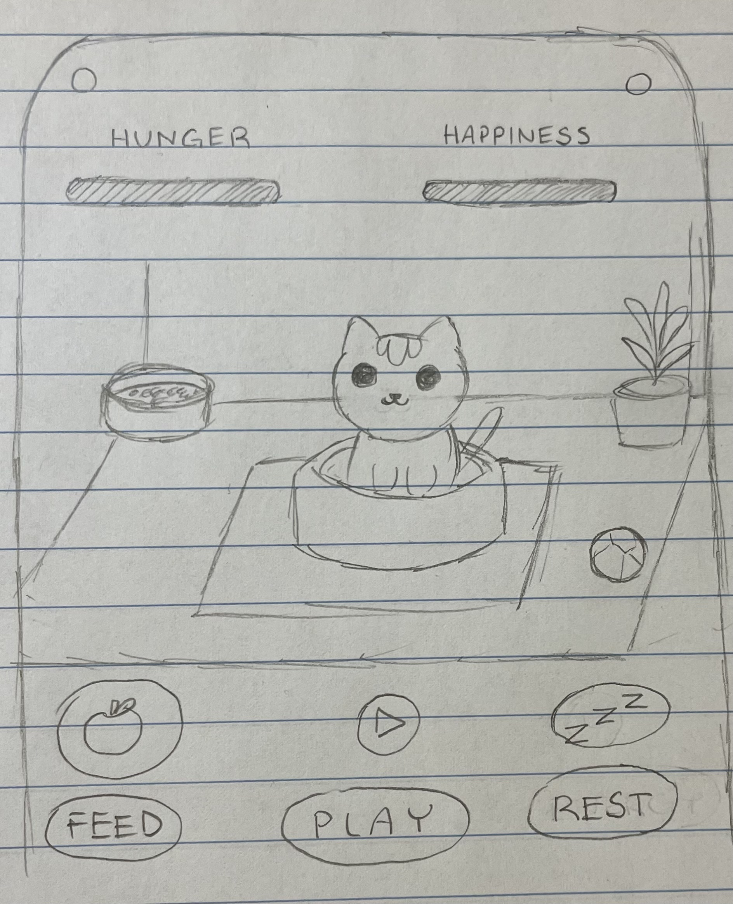

:warning: Everything between << >> needs to be replaced (remove << >> after replacing)

# VirtuPets
## CS110 B1 Final Project  Semester 1, 2024

## Team Members

Jordan Lee

***

## Project Description

This project is a pet simulator game where players care for a virtual pet by managing its needs like hunger, energy, and happiness. Players can interact with the pet through activities like feeding, playing, and letting it rest.

***    

## GUI Design

### Initial Design

### Final Design

## Program Design

### Features

1. Start Menu
2. Movable Pet Character
3. Interaction Buttons (Feed, Play, Sleep)
4. Stat Display (hunger, happiness, energy)
5. Game Over screen (if the pet’s health declines too much)

### Classes
#### **Pet Class**
Attributes:
- `name`: str - the pet's name
- `x`: int - x-coordinate position
- `y`: int - y-coordinate position
- `img_file`: str - image representing the pet
- `hunger`: int - hunger level of the pet
- `happiness`: int - happiness level of the pet

Methods:
- `__init__(name, x, y, img_file)`
- `move(dx, dy)`
- `feed()`
- `play()`

#### **Food Class**
Attributes:
- `x`: int - x-coordinate position
- `y`: int - y-coordinate position
- `img_file`: str - image representing the food

Methods:
- `__init__(x, y, img_file)`
- `is_eaten(pet_x, pet_y)`

## ATP

| Step                 |Procedure             |Expected Results                   |
|----------------------|:--------------------:|----------------------------------:|
|  1                   | Run Counter Program  |GUI window appears with count = 0  |
|  2                   | click count button   | display changes to count = 1      |
etc...
